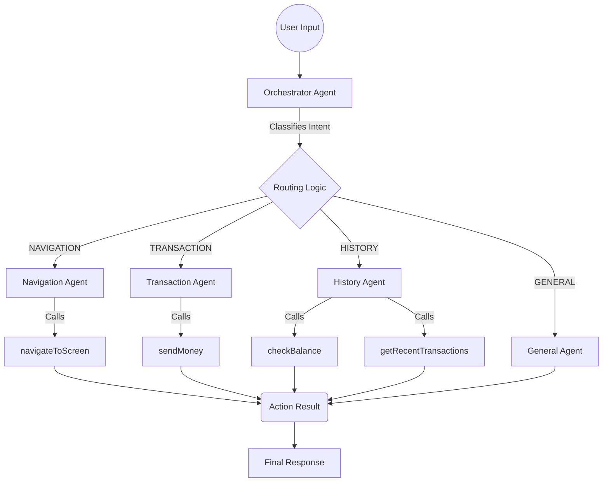

# Payment UI Setup

I have generated the React Native code for your Payment UI.

## Environment Note
The project was initialized manually because of Node.js version mismatches in your environment.
- **Node Version**: You are running v14, but React Native 0.73+ requires Node 18+.
- **Native Folders**: The `android` and `ios` folders are **missing** because the automatic generator failed.

## How to Run

### 1. Fix Environment
Ensure you are using Node 18:
```bash
nvm use 18
```

### 2. Generate Native Projects
To run on Android/iOS Emulator, you need to generate the native code:
```bash
npx react-native upgrade
# OR
npx react-native eject
```
(Accept prompts to generate files).

### 3. Start the App
```bash
npx react-native start
```
In a separate terminal:
```bash
npx react-native run-android
```
npx react-native run-android
```

## Agent Architecture

This application uses a multi-agent system orchestrator pattern powered by **LangGraph** and **Ollama (Gemma 3 1B)**.

### Architecture Flow



### Components
1.  **Orchestrator**: Classifies user intent into distinct categories.
2.  **Specialized Agents**: 
    - **Navigation**: Handles screen transitions.
    - **Transaction**: Manages payments and transfers.
    - **History**: Queries balances and past transactions.
    - **General**: Handles chit-chat and fallback queries.
3.  **Local "Brain"**: Uses `Ollama` running `gemma3:1b` locally for privacy and offline capability.
